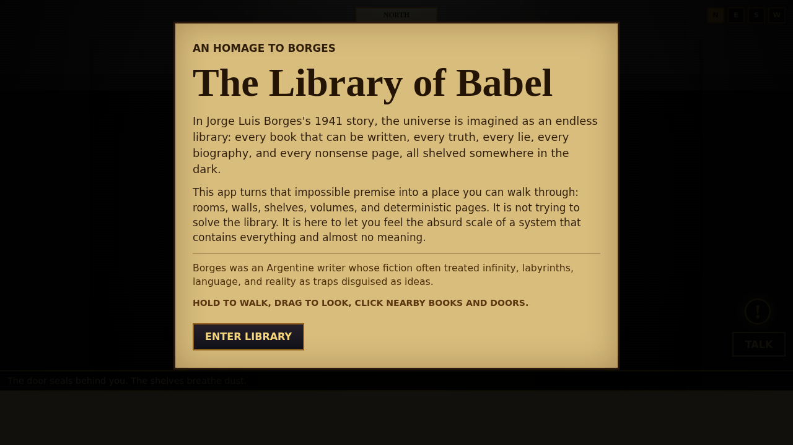

# Library of Babel

An interactive homage to Jorge Luis Borges's **The Library of Babel**.

Play it here: <https://ryanbieber.github.io/libraryofbabel/>



## About

This project turns Borges's impossible library into a browser-based space: rooms, walls, shelves,
volumes, and deterministic pages. It is not an adaptation, solution, or archive. It is a small game-like
tribute to the story's unsettling premise: a universe that contains every possible book, almost all of it
meaningless, with truth hidden somewhere inside the noise.

No book text is stored. Pages are generated in the browser from a book address and page number, so the
same coordinates always return the same page.

## Scale

The app uses the story's familiar book structure:

- 410 pages per book
- 40 lines per page
- 80 symbols per line
- 25 symbols in the alphabet
- 1,312,000 symbols per book

## Controls

- Hold to walk forward.
- Drag while holding to look around.
- Click or tap nearby books and doors.

## Development

```sh
npm install
npm run dev
```

## Validation

```sh
npm run lint
npm test -- --run
npm run build
```

## Deployment

GitHub Pages deploys from `.github/workflows/pages.yml` when changes land on `main`.
